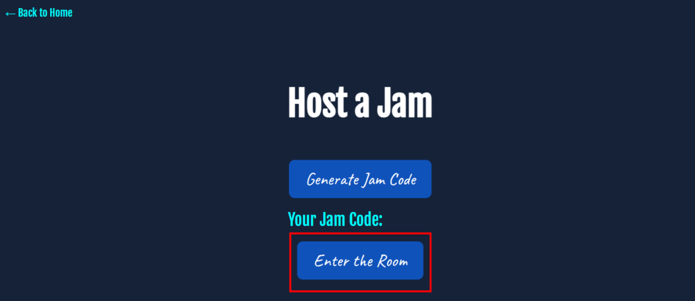

# 🎶 JamSesh: Multi-device audio playback with WebRTC 

**JamSesh** is a real-time, multi-device audio streaming app built with WebRTC. One device acts as the master and streams audio, while other devices as clients can join at any time and hear the same audio in perfect sync whether in the same room (to create a speaker-like effect) or across the internet. The core focus is on achieving minimal latency for a seamless, synchronized listening experience.
### Hosted website 
- Open [JamSesh](https://jamsesh-8wui.onrender.com/)

### Documentation
- For Developer Guide: [Read our developer guide.](docs/DEVELOPER_GUIDE.md)
- For Contributing: [Read our Contributing guide.](docs/CONTRIBUTING.md)

# How to use JamSesh?
### For Hosting 
Enter a name in the textbox and click on `Host a Jam`

Click on `Generate Jam Code` and `Enter Room`

Click on `Room Code` to copy the room code and send it to your friends and click on `Start Jam` to start streaming any tab you want.

Host can end jamming at anytime by clicking on `End Jam`

**⚠️ IMPORTANT NOTE:** It's recommended that the host mute their local audio playback to prevent audio feedback and synchronization issues.

### For clients
Similarly for clients, enter your name and click on `Join a Jam`

Enter a valid jam-code

Enjoy your jamming session with your friends! 

You can exit anytime by clicking on `Exit`
# Mentees:
 - Arjun Gowda ([@Gowda-Arjun](https://github.com/Gowda-Arjun/))
 - Maaya Mohan ([@maayamohan](https://github.com/maayamohan/))
 - Srivani Karanth ([@SriK-1](https://github.com/SriK-1/))
 - Tisya Agarwal ([@SolarPhoenix13](https://github.com/SolarPhoenix13/))
 - Vanshitha Soma ([@vanshsoma](https://github.com/vanshsoma/))

# Mentors:
 - Andey Hemanth ([@andy34g7](https://github.com/andy34g7/))
 - Mebin Thattil ([@mebinthattil](https://github.com/mebinthattil/))
 - Vinaayak G Dasika ([@Delta18-Git](https://github.com/Delta18-Git/))
